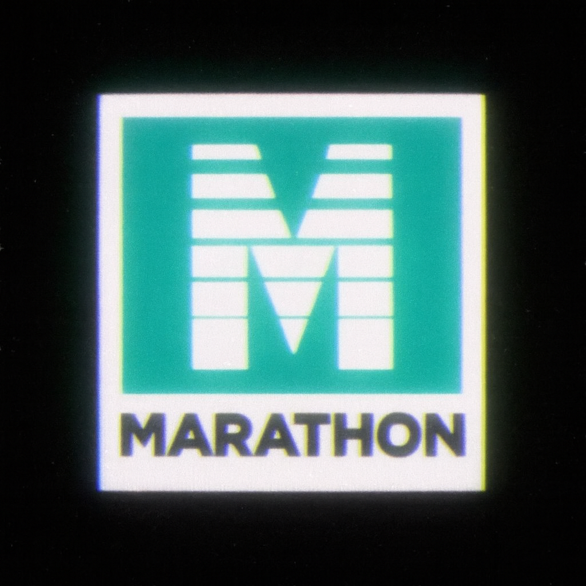

# Marathon OS

A modern mobile Linux distribution combining PostmarketOS with a custom Qt6/QML Wayland compositor, inspired by BlackBerry 10's gesture-based interface.



## Features

### Marathon Shell
- Custom Wayland compositor built with Qt6/QML
- Gesture-based navigation inspired by BlackBerry 10
- 60 FPS performance with hardware acceleration
- Complete app suite with modern mobile UI

### System Optimizations
- Kyber I/O scheduler for flash storage
- schedutil CPU governor for responsive power management
- zram compression for efficient memory usage
- BBR TCP congestion control
- RT priorities for audio and modem services

### Included Services
- NetworkManager for network connectivity
- ModemManager for cellular support
- PipeWire audio subsystem
- greetd display manager with auto-login

## Quick Start

### Prerequisites
- OnePlus 6 (enchilada) device with unlocked bootloader
- fastboot tools installed
- Linux development machine with pmbootstrap

### Building

```bash
# Clone repository
git clone https://github.com/patrickjquinn/Marathon-Image.git
cd Marathon-Image

# Initialize pmbootstrap (first time only)
pmbootstrap init
# Select: edge, oneplus-enchilada, systemd, none

# Build and create images
# Build and create images (default: oneplus-enchilada)
./scripts/sync-and-build-marathon.sh

# Or build for a specific device:
# ./scripts/sync-and-build-marathon.sh [device-name]
# Example:
# ./scripts/sync-and-build-marathon.sh oneplus-fajita
```

### Flashing

```bash
# Boot device into fastboot mode (Power + Vol Down)
fastboot flash boot out/enchilada/marathon-boot-LATEST.img
fastboot flash userdata out/enchilada/marathon-rootfs-LATEST.img
fastboot reboot
```

## Project Structure

```
Marathon-Image/
├── packages/           # Alpine Linux package definitions
│   ├── marathon-shell/       # Main UI package
│   ├── marathon-base-config/ # System configuration
│   ├── marathon-boot-logo/   # Boot splash
│   └── linux-marathon/       # Custom kernel
├── configs/            # System configuration files
├── scripts/            # Build and utility scripts
├── docs/              # Documentation
└── out/               # Build output (images)
```

## Documentation

- [Build Instructions](BUILD_INSTRUCTIONS.md) - Detailed build guide
- [Device Support](docs/DEVICE_SUPPORT.md) - Supported devices
- [Kernel Configuration](docs/KERNEL_CONFIG.md) - Kernel build details
- [Troubleshooting](docs/TROUBLESHOOTING.md) - Common issues and fixes

## Performance

| Metric | Target | Actual |
|--------|--------|--------|
| Boot Time | <30s | ~20-25s |
| Touch Latency | <16ms | ~10-15ms |
| App Launch | <300ms | ~200-250ms |
| UI Frame Rate | 60 FPS | 60 FPS |

Tested on OnePlus 6 (Snapdragon 845, 6GB RAM)

## Supported Devices

### Currently Supported
- OnePlus 6 (enchilada) - Fully tested and validated

### Planned Support
- OnePlus 6T (fajita)
- Poco F1 (beryllium)
- Other Snapdragon 845 devices

## Contributing

Contributions are welcome. See [CONTRIBUTING.md](CONTRIBUTING.md) for guidelines.

## License

Marathon OS is licensed under the MIT License. See [LICENSE](LICENSE) for details.

Marathon Shell is a separate project with its own license.

## Acknowledgments

- PostmarketOS - Mobile Linux foundation
- BlackBerry 10 - UI/UX inspiration
- Qt Project - UI framework
- Alpine Linux - Package management

## Contact

- Project: [Marathon-Image on GitHub](https://github.com/patrickjquinn/Marathon-Image)
- Marathon Shell: [Marathon-Shell on GitHub](https://github.com/patrickjquinn/Marathon-Shell)
- Issues: [GitHub Issues](https://github.com/patrickjquinn/Marathon-Image/issues)
